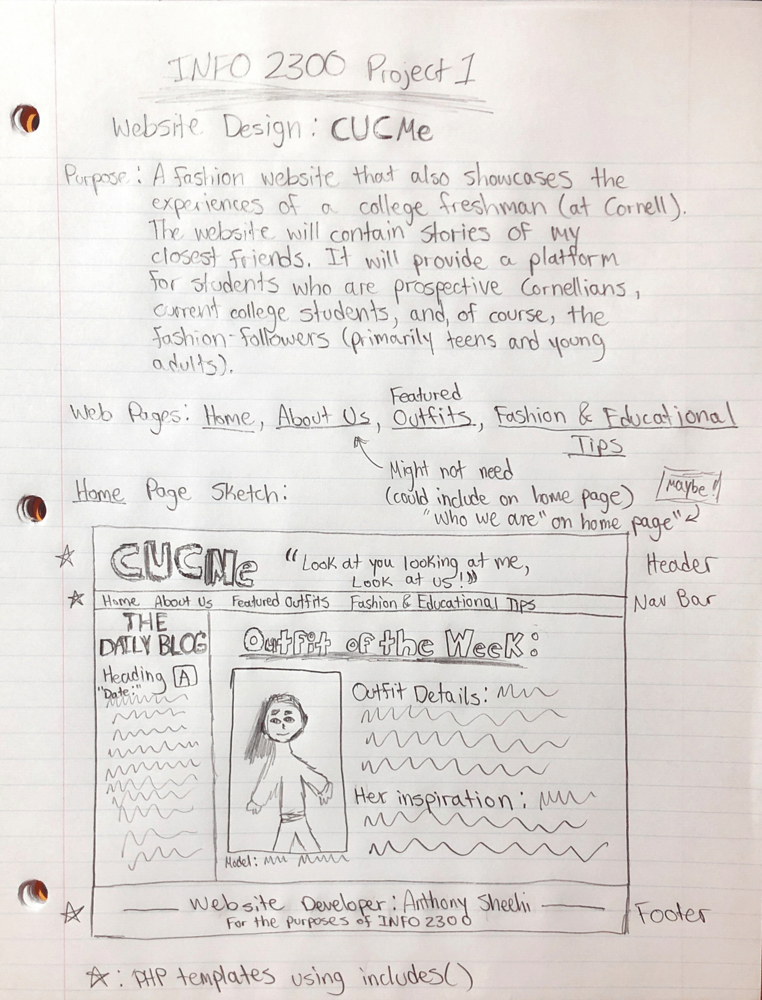
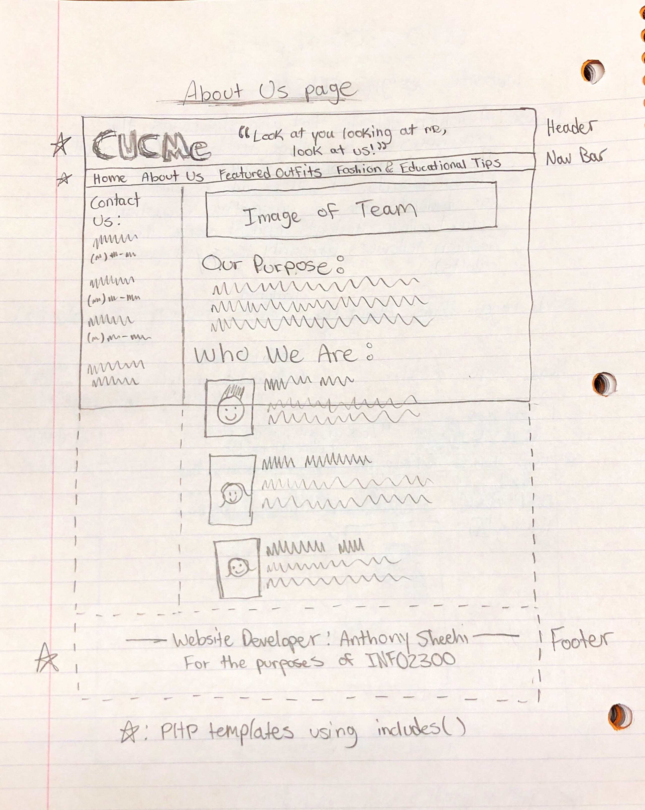
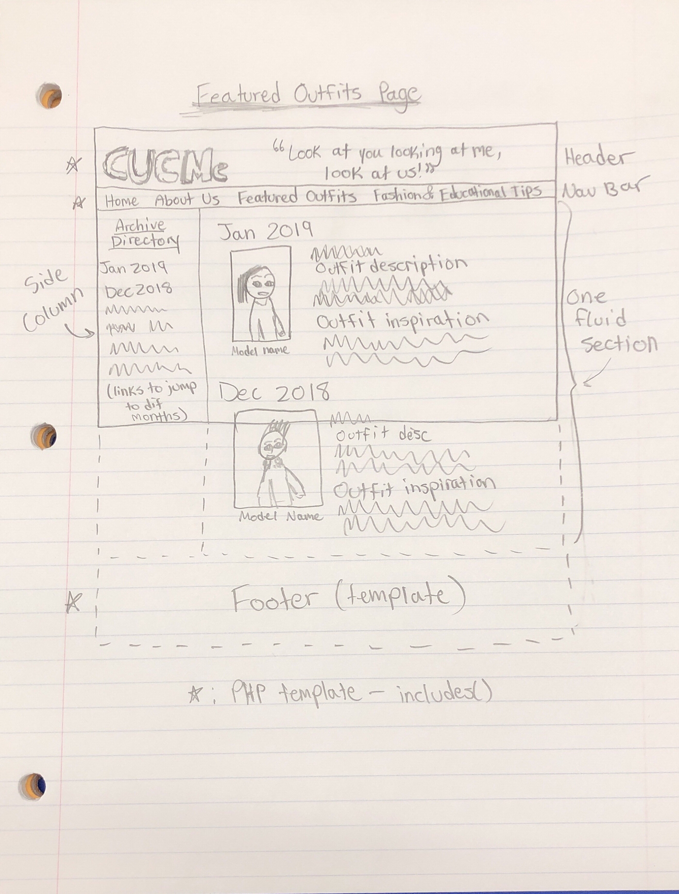
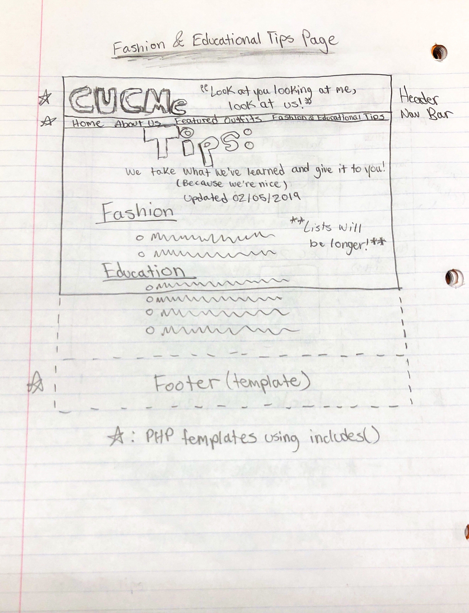

# Project 1: Design Journey

Your Name: Anthony Sheehi

**All images must be visible in Markdown Preview. No credit will be provided for images in your repository that are not properly linked in Markdown. Assume all file paths are case sensitive!**

# Project 1, Milestone 1 - Design & Plan

## Website Topic

[Tell us what your website is about. What are you promoting?]

CUSeeMe (pronounced "see you see me"):
    A fashion website that also showcases the experiences of a college freshman (at Cornell).
    The website will contain stories of me and my closest friends. It will provide a platform
    for students who are prospective Cornellians, current college students, and, of course.
    By creating this site, I am promoting the spread of information regarding the average daily
    life of a college student in conjunction with good fashion tips to give it an appealing twist.

## Target Audiences

[Tell us about your two target audiences.]

Prospective and current college students: Whether Cornell students or not, there are many aspects of the site that will pertain to the general college student.
Fashion-followers: The fashion aspect is what makes CUCMe stand out from the abyss of personal college blogs, vlogs, and websites. Fashion gurus can appreciate the *art* that can be found on our site thanks to the most fashionable people I know.

## Design Process

[Document your design process. Show us your sketches. Show us your card sorting. Show us the evolution of your design from your first idea (sketch) to design you wish to implement (sketch). Show us the process you used to organize content and plan the navigation (card sorting).]

[Thoroughly document this process. The _process_ is the important part of this assignment, not the final result.]

## Final Design Plan

[Include sketches of your final design here. Don't forget to design the form and its confirmation page!]

[Include your site navigation here. Describe the content on each page. Tip: use bulleted lists.]

Home Page

    * The Daily Blog
        * Author, Date, Title heading
    * The Outfit of the Week
        * Model photo w/ outfit
        * Outfit Description
        * Outfit Inspiration

About Us

    * Our Purpose
    * Who We Are
        * Description of each person

Featured Outfits

    * An archive of outfits (previous outfits of the week)
        * Descriptions of outfits and inspirations

Fashion & Educational Tips

    * Updated list of fashion tips (header w/ section)
    * Updated list of educational tips (header w/ section)

## Target Audiences' Needs

[Tell us how your design meets the needs of both of your target audiences.]

CUSeeMe is a website where college students (and those looking to attend collge) gain access to life hacks that deal with school life as well as fashion. Aside from providing some comedic relief, my website aims to give its audience legitimate advice on how to survive college. Many of these tips will be Cornell specific, but there will also be a lot to gain even if you're not a Cornellian. As far as the fashion aspect goes, the website will contain high-quality photographs of trendy outfits seen on campus (with model consent and proper citation of course). Along with the fashion tips provided, the intended goal is for fashionistas to find the website simultaneously entertaining and insightful.

## Templates

[Now that you've finalized your design, identify the templates you will use on your site.]

Templates to be used

    * Header
        * Containing the Website title, header artwork, etc.
    * Navigation Bar
        * Containing links to all four web pages (w/ current page indicator)
    * Footer
        * Containing development information as well as citations necessary

# Project 1, Milestone 2 - Draft Website

## Sticky Form

[What fields are required for your form?]

    *First Name
    *Fashion or educational tip

[Plan out your error messages for your target audiences here.]

    * If the tip is more than 150 characters, then the user will receive an error and asked to lower the char count.
        * "Maximum: 150 chars, lower the char count by (# of chars - 150)."
    * If there is nothing in the input (blank, spaces), then the user will receive an error.
        * "Please type a tip to submit!"

## Validation Code Plan

[Write out your pseudocode plan for handling the validation of the form.]

Trim the name and check to see if it is empty
  * If it is empty, set error bool to true
  * If it is not, then maintain false (don't do anything)
For the tip, make sure there's a message (same technique)
  * If it is empty, set error bool to true
  * If it is not, then maintain false (don't do anything)

# Final Submission: Complete & Polished Website

## Target Audiences

[Tell us how your final site meets the needs of the target audiences. Be specific here. Tell us how you tailored your design, content, etc. to make your website usable by both target audiences.]

The website includes photographs of people (and commentary on the 'Outfit of the Week') There is also a daily blog that incorporates aspects of student life and a hint of fashion. The tips are the most valuable part of the website at this early stage. Here, both audiences (students & fashion followers) are tailored to. It is intriguing and engaging. By including the 'About Us' page, I am creating a sense of familiarity with the audeince.

## Reflection

[Take this time to reflect on what you learned during this assignment. How have you improved from 1300? What things did you have trouble with?]

This website was my first experience ever dabbling in the world of web development. I took a crash course in HTML and CSS years ago so a lot of the topics and syntax were hazy at first. It was very fun and insightful to look up how to achieve certain effects on the website and learning from those techniques. I had trouble with most concepts at first, but once I got them down I was able to use them over and over again. The learning curve for this project was extremely apparent for me, because I spent so long just getting started but once I became proficient, the process was at least five times as fast. Making columns and worrying about padding and constraints was something I experimented and struggled a lot with (especially with columns). There were also some formatting issues with the borders and I was connecting elements between separate pages (so organization is something I can certainly imporve on for next time). The sticky form provided me with some trouble, especially because I spent a while trying to figure out how checkboxes worked. Overall, I really enjoyed this assignment and I am very proud of my final product.
